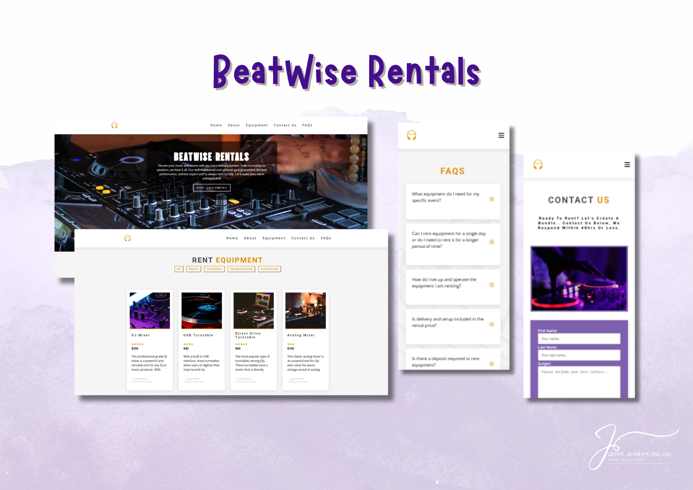

# BeatWise Rental Website

## Table of contents

- [Overview](#overview)
  - [The challenge](#the-challenge)
  - [Screenshot](#screenshot)
  - [Links](#links)
- [My process](#my-process)
  - [Built with](#built-with)
  - [What I learned](#what-i-learned)
  - [Continued development](#continued-development)
  - [Useful resources](#useful-resources)

## Overview
A website for disk jockey equipment rentals  

### The challenge

Users should be able to:

-	Find out more about BeatWise the company, and their available equipment for rental, contact the company through a submit form, and get frequently asked questions answered.
-	Navigate the page using the nav bar links
-	Access a functional navbar hamburger menu through mobile screens
-	Use filter buttons for the equipment menu for easier access navigating through the list of items   
-	Press the plus buttons on FAQs questions to read the answers of frequently asked questions 

### Screenshot

### Links

- Solution URL: https://github.com/Jud1th1/rentals-website
- Live Site URL: https://beatwiserentals.netlify.app/

## My process
-	To start this website, I followed along with the FreeCodeCamp slider tutorial for the base of my website. 
-	Together we set up the html, stylesheet and JavaScript. 
-	The first thing we did in JavaScriptwas add a dynamic date element to set the year in our footer dynamically without requiring us to go back into the code every year to update the code using the getFullYear method.
-	We created a navbar with the following features:
    •	A fixed position at the top of the screen, and it changes its style when the user scrolls down the page.
    •	A toggle button that shows and hides the links of the navigation menu.
-   Here are a few code snippets:
    -	Element.getBoundingClientRect() to get the size and position of an element relative to the viewport.
    -	window.pageYOffset to get the number of pixels the document has been scrolled vertically.
    -	String.slice() to extract a section of a string without modifying the original string.
    -	Element.classList to manipulate the classes of an element.

-	I also added a menu element here with the following features:
    -	A list of items with their names, prices, and descriptions.
    -	Buttons to filter the items by category.
-   Some code here includes the following concepts:
    •	An array of objects to store the items and their properties.
    •	A function to display the items and their details.
    •	Array methods like Array.filter() and Array.map() to filter and transform the array of items.
    •	Template literals to create HTML elements dynamically.
    •	Event delegation to handle events on dynamically created elements.
    
-   The last JavaScript code was for the FAQs section to add a click event listener to the questions. 
-   When the user clicks on a question, the code toggles the visibility of the answer for that question and hides the answer for all other questions using the classList.toggle() method. 
-   As I went along, I updated the stylesheet to reflect the color scheme and branding of the BeatWise company that my partner and I picked before setting up this project. The theme included a purple and gold, "fun", tech modern vibe. 

### Built with

- HTML
- Flexbox
- CSS
- Javascript
- Desktop to Mobile workflow

### What I learned

-	Using the getFullYear method to dynamically display the current year in the footer.
-	Creating a navbar with fixed positioning, style changes on scroll, a toggle button, and a link to the top of the page.
-	Using JavaScript concepts to manipulate and interact with HTML elements.
-	Adding a menu element with items, prices, and descriptions, as well as buttons to filter the items by category.
-	Implementing event delegation to handle events on dynamically created elements.
-	Also: a big takeaway is  to remerb that javascript implement inline styling and can override my CSS code. 

### Continued development

I would love to continue improving the existing features and functionality of the website, such as optimizing the website's performance, improving its accessibility, and enhancing its design and user experience.

### Useful resources

- https://www.youtube.com/watch?v=3PHXvlpOkf4&t=423s   //Slider, menu, questions tutorials all were used in this project
